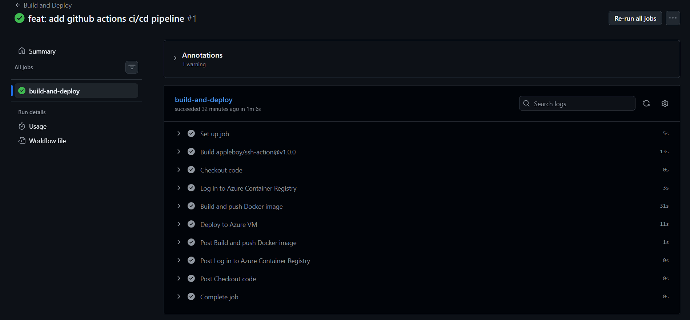
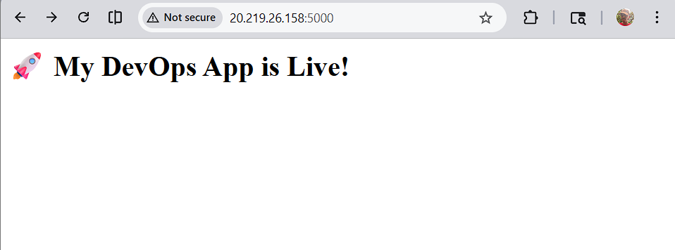

# 🚀 Full DevOps Lifecycle Project on Azure

A production-grade DevOps project that demonstrates the full lifecycle of application deployment using modern DevOps tools.

## 🏗️ Architecture

Developer pushes code to GitHub
↓
GitHub Actions (CI/CD) triggers
↓
Builds Docker image → Pushes to Azure Container Registry
↓
Ansible configures Azure VM
↓
App is live on the internet

## 🛠️ Tech Stack

| Tool | Purpose |
|------|---------|
| Python Flask | Web application |
| Docker | Containerization |
| Terraform | Infrastructure as Code |
| Ansible | Server configuration |
| GitHub Actions | CI/CD pipeline |
| Azure VM | Cloud hosting |
| Azure Container Registry | Docker image storage |
| Linux (Ubuntu) | Server OS |

## 📁 Project Structure

my-devops-project/
├── app/
│   ├── app.py              # Flask application
│   ├── Dockerfile          # Container definition
│   └── requirements.txt    # Python dependencies
├── terraform/
│   └── main.tf             # Azure infrastructure code
├── ansible/
│   ├── inventory.ini       # Server inventory
│   └── playbook.yml        # Server configuration
└── .github/
└── workflows/
└── deploy.yml      # CI/CD pipeline

## 🚀 How It Works

### 1. Infrastructure (Terraform)
Terraform provisions all Azure resources with a single command:
- Resource Group, Virtual Network, Subnet
- Azure VM (Ubuntu), Public IP
- Network Security Group
- Azure Container Registry

### 2. Server Configuration (Ansible)
Ansible automatically configures the VM:
- Installs Docker and dependencies
- Starts Docker service
- Configures user permissions

### 3. Application (Docker)
Flask app is containerized with Docker:
- `/` - Homepage
- `/health` - Health check endpoint
- `/info` - App information

### 4. CI/CD Pipeline (GitHub Actions)
Every push to main branch automatically:
1. Builds Docker image
2. Pushes to Azure Container Registry
3. SSHes into Azure VM
4. Pulls new image and restarts container

## 🏃 How to Run

### Prerequisites
- Azure account
- Terraform installed
- Ansible installed
- Docker installed

### Steps

**1. Clone the repo**
```bash
git clone https://github.com/stevebaretto68-lgtm/my-devops-project
cd my-devops-project
```

**2. Provision infrastructure**
```bash
cd terraform
terraform init
terraform apply
```

**3. Configure VM**
```bash
cd ansible
ansible-playbook -i inventory.ini playbook.yml
```

**4. Add GitHub Secrets**
- `ACR_USERNAME`
- `ACR_PASSWORD`
- `VM_HOST`
- `VM_USERNAME`
- `SSH_PRIVATE_KEY`

**5. Push code to trigger pipeline**
```bash
git push origin main
```

## 📸 Screenshots




## 👨‍💻 Author
Steve Baretto
